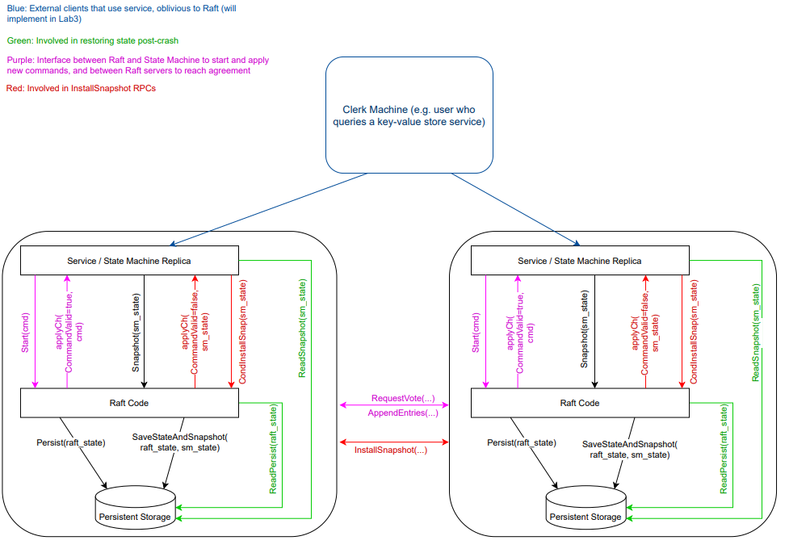

# 6.824: Distributed System

It will present abstractions and implementation techniques for engineering distributed systems. Major topics include fault tolerance, replication, and consistency. Much of the class consists of studying and discussing case studies of distributed systems.

[Course 2022](https://pdos.csail.mit.edu/6.824/schedule.html)

# Labs

## Lab 1: MapReduce

构建一个 MapReduce 系统，参考 MapReduce 论文相关内容

## Lab 2: Raft

参考 [Raft 论文](https://github.com/maemual/raft-zh_cn/blob/master/raft-zh_cn.md)实现相关算法

主要难点在于理解并复现 Raft 算法

- Part 2A: 实现 leader 选举
- Part 2B: 实现日志复制
- Part 2C: 实现持久化服务
- Part 2D: 实现日志压缩（快照）

## Lab 3: Fault-tolerant Key/Value Service

基于 Lab2 实现的 Raft, 构建一个容错的 kv 存储服务, 理解线性一致性

主要难点在于如何处理配合 Raft 实现读写的线性一致性

- Part 3A: 实现没有快照的存储服务
- Part 3B: 实现带快照的存储服务

## Lab4: Sharded Key/Value Service

基于 Lab2 实现的 Raft, 构建一个分片容错的kv存储服务，理解分片提升系统性能

主要难点在于如何处理分片的动态配置变化导致集群之间分片数据的迁移

- Part 4A: 实现分片控制器，用来协调 raft 集群和分片之间的关系
- Part 4B: 实现分片服务器

# Lab 结构

